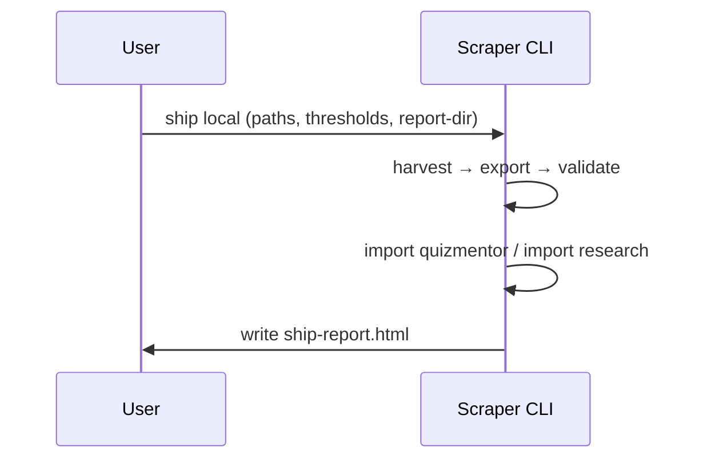

# Architecture Gallery

## At a glance

```mermaid
flowchart LR
  A[Sources\n(docs, SO, GitHub)] --> B[Harvesters\nMassive/Enhanced]
  B --> C[(SQLite\nharvest.db)]
  C --> D[Export\nquizzes JSON]
  D -->|dock| E[QuizMentor\nquizzes/]
  C --> F[Import\nAI-Research]
  F --> G[Markdown summaries]
```

### SVGs

<SvgGallery />

## Ship sequence (text)



## Cross-links
- README (pipeline and adapters)
- [EPICS](/specs/) (see Epics for productization goals)
- [JOURNEYS](/specs/) (user and S2S journeys)
- [System Status](/SYSTEM_STATUS)

