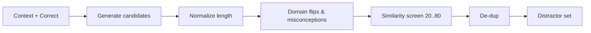

# Distractor generation (wrong answers)

## TL;DR
Wrong answers should be plausible but distinct—neither trivially wrong nor almost identical to the right one. We balance length, domain relevance, and semantic distance, and we screen for duplicates.

## Approach
- Massive: category‑aware lists (AWS/Kubernetes/etc.), length‑normalized to match the correct answer, with generic fallbacks.
- Enhanced (layered):
  - Domain misconceptions (async vs blocking, storage types)
  - Polarity flips (is↔is not, can↔cannot, synchronous↔asynchronous, stateful↔stateless, mutable↔immutable, public↔private, client↔server)
  - Context‑mined technical terms (e.g., “A <Term>-based solution”)
  - Similarity screening: reject too‑close (>80) or too‑far (<20), remove near‑duplicates

## Diagram

## Notes
- Length normalization keeps answer lengths comparable (avoid giveaways)
- Domain pools ensure plausibility (K8s, AWS, DB, etc.)
- Screen similarity bands (too similar → confusing; too far → obviously wrong)

## See also
- Uniqueness & dedup → /concepts/uniqueness
- Scoring → /concepts/scoring

