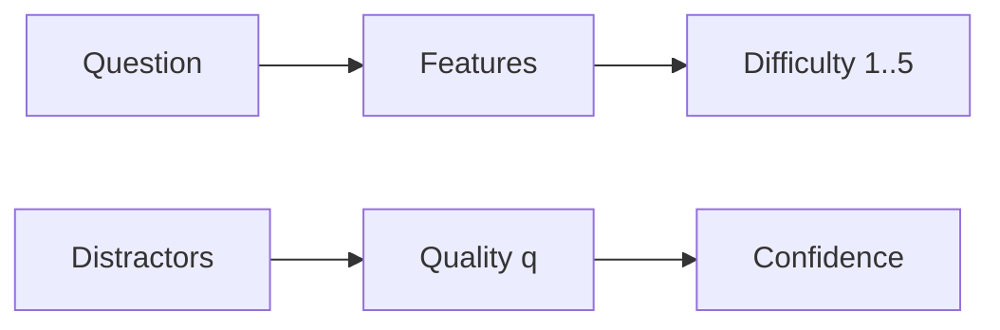

# Scoring (difficulty & confidence)

## TL;DR
Difficulty reflects how challenging a question is (1–5). Confidence reflects how likely the generator believes the question is correct and unique.

## Difficulty
- Massive (heuristic features)
  - Longer question text → harder
  - Analysis verbs (“explain”, “compare”, “analyze”, “evaluate”) → harder
  - Longer average option length → harder
  - Higher option similarity → harder
  - Returns 1–5
- Enhanced (heuristic)
  - Concept complexity (name length, digits/underscores/hyphens)
  - Context length (>1000)
  - Distractor quality
  - Returns 1–5

## Confidence
- Massive: fixed 0.8
- Enhanced: 0.5 + 0.3*distractor_quality + 0.2 if many concepts (>3)

## Diagram

## See also
- Uniqueness → /concepts/uniqueness
- Distractors → /concepts/distractors

