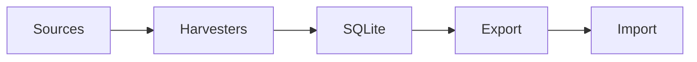

# Lesson 00 – Start Here

A narrative introduction to the Scraper system.

## Diagram (Mermaid)

## Mini-lab (5–10 min)
- Run a small harvest to /tmp; export quizzes; dry-run research import.

## Grok check
- What does idempotent mean in this project?
- When do we skip near-duplicates and how is it detected?

## Mastery

<MasteryChecklist id="lessons/00-intro" :items='[
  "Explain the end-to-end pipeline (harvest → export → validate → import)",
  "Run a tiny local harvest and export",
  "Describe idempotency in the importers",
  "Open the generated HTML report"
]' />

