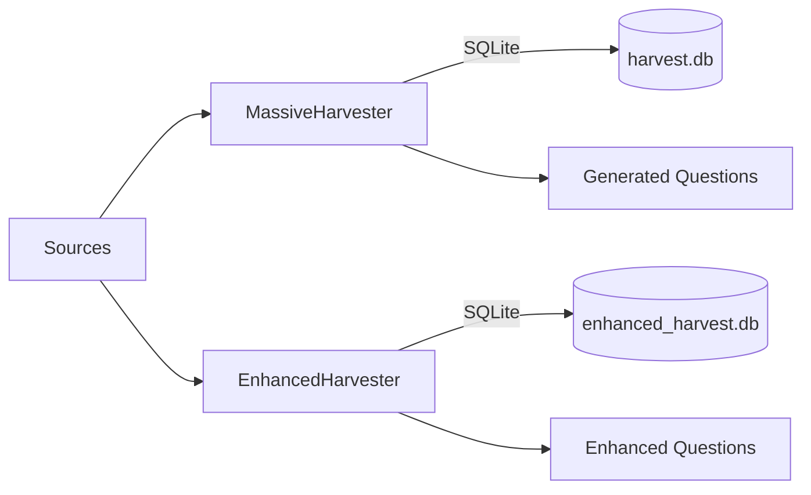

# Lesson 01 – Harvesters (Massive vs Enhanced)

Narrative: Compare breadth-first Massive with quality-focused Enhanced. Massive sweeps broad sources into SQLite and generates questions with deterministic heuristics; Enhanced focuses on semantic uniqueness, answer balance, and distractor quality.

## Code (where this lives)

```python path=/Users/betolbook/Documents/github/Scraper/src/scraper/harvesters/massive.py start=66
class MassiveHarvester:
    """Massive content harvester for quiz and learning content generation"""

    def __init__(self, output_dir: str = "./harvest_output", teach: bool = False):
        self.output_dir = Path(output_dir)
        self.output_dir.mkdir(exist_ok=True)
        # Database for tracking
        self.db_path = self.output_dir / "harvest.db"
        self._init_database()
        # caches, stats, simhash config, HTTP session ...
```

```python path=/Users/betolbook/Documents/github/Scraper/src/scraper/harvesters/enhanced.py start=61
class EnhancedHarvester:
    """Enhanced harvester with better source management and quality control"""

    def __init__(self, output_dir: str = "./harvest_output", teach: bool = False):
        self.output_dir = Path(output_dir)
        self.output_dir.mkdir(exist_ok=True)
        self.used_sources = set()
        self.answer_distribution = Counter()
        self.vectorizer = TfidfVectorizer(max_features=1000)
        # DB: enhanced_harvest.db
```

```python path=/Users/betolbook/Documents/github/Scraper/src/scraper/cli.py start=131
# CLI wiring
harvest_parser = subparsers.add_parser("harvest", help="Harvest content and generate questions")
harvest_sub = harvest_parser.add_subparsers(dest="harvest_command")

massive = harvest_sub.add_parser("massive", help="Run the massive harvester")
massive.add_argument("--output-dir", default="./harvest_output")
# ...
massive.set_defaults(func=cmd_harvest_massive)

enhanced = harvest_sub.add_parser("enhanced", help="Run the enhanced harvester (interactive)")
enhanced.add_argument("--output-dir", default="./harvest_output")
enhanced.set_defaults(func=cmd_harvest_enhanced)
```

## Diagram


## Mini-lab
- Run both harvesters on a small corpus; compare counts and confidence.

Commands
```bash
# Massive (breadth)
scraper harvest massive \
  --output-dir /tmp/harvest_massive \
  --max-content 100 --questions-per-content 5 --workers 8 --complete

# Enhanced (quality; interactive)
scraper harvest enhanced \
  --output-dir /tmp/harvest_enhanced
```

Expected outputs
- Massive: /tmp/harvest_massive/harvest.db with tables harvested_content, generated_questions; a CSV report and stats printed to console.
- Enhanced: /tmp/harvest_enhanced/enhanced_harvest.db with enhanced_questions, source_usage, and a console stats table.

## Grok check
- When would you prefer Enhanced over Massive?

## Mastery
<MasteryChecklist id="lessons/01" :items='[
  "Run Massive on 50 contents",
  "Run Enhanced on 50 contents",
  "Compare confidence distributions",
  "Note tradeoffs in logs"
]' />

