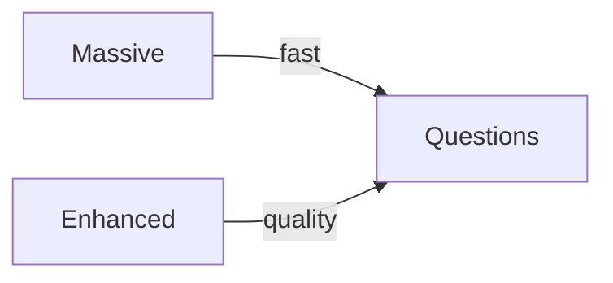

# Lesson 01 – Harvesters (Massive vs Enhanced)

Narrative: Compare breadth-first Massive with quality-focused Enhanced.

## Diagram


## Mini-lab
- Run both harvesters on a small corpus; compare counts and confidence.

Commands
```bash
# Massive (breadth)
scraper harvest massive \
  --output-dir /tmp/harvest_massive \
  --max-content 100 --questions-per-content 5 --workers 8 --complete

# Enhanced (quality)
scraper harvest enhanced \
  --output-dir /tmp/harvest_enhanced \
  --max-content 100 --questions-per-content 5 --workers 4
```

## Grok check
- When would you prefer Enhanced over Massive?

## Mastery
<MasteryChecklist id="lessons/01" :items='[
  "Run Massive on 50 contents",
  "Run Enhanced on 50 contents",
  "Compare confidence distributions",
  "Note tradeoffs in logs"
]' />

