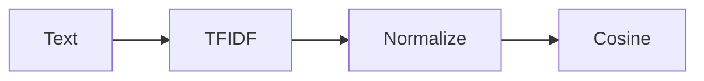

# Lesson 02 – TF‑IDF & Uniqueness

Narrative: Vectorize questions; ensure semantic uniqueness via cosine and ratio.

## Diagram


## Mini-lab
- Compute cosine max to existing; enforce < 0.85.

Commands (inspect uniqueness via report)
```bash
# One-shot run with previews to inspect uniqueness decisions in the report
scraper ship local \
  --qm /path/to/QuizMentor.ai/quizzes \
  --research /path/to/AI-Research \
  --report-dir ./reports \
  --preview --strict --max-content 60 --questions-per-content 5
# Open: ./reports/ship-report.html and review dedupe/uniqueness sections
```

## Grok check
- Why normalize vectors before cosine?

## Mastery
<MasteryChecklist id="lessons/02" :items='[
  "Build TF‑IDF vectors",
  "Compute cosine to nearest",
  "Apply threshold < 0.85",
  "Explain normalization"
]' />

