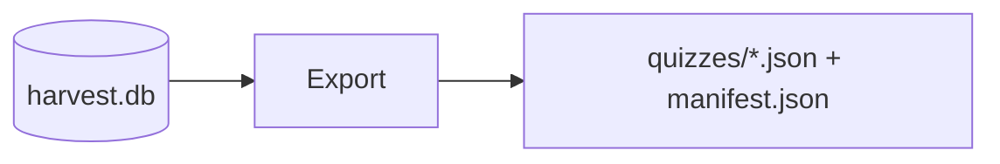

# Lesson 03 – Exporters & Manifests

Narrative: Filter by confidence and emit quizzes + manifest.

## Diagram


## Mini-lab
- Export with min confidence 0.75; inspect manifest totals.

Commands
```bash
# Export from an existing harvest DB
scraper export quizmentor --db /tmp/harvest/harvest.db --out ./out

# Inspect manifest (if you have jq)
jq . ./out/manifest.json | head -n 40 || true
```

## Grok check
- What does the manifest prove vs minimal schema?

## Mastery
<MasteryChecklist id="lessons/03" :items='[
  "Run export quizmentor",
  "Open a quiz_*.json",
  "Open manifest.json",
  "Explain confidence filter"
]' />

