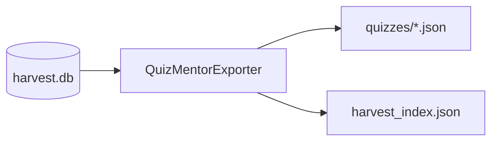

# Lesson 03 – Exporters & Manifests

Narrative: Filter by confidence and emit quizzes + manifest.

## Diagram


## Mini-lab
- Export with min confidence 0.75; inspect manifest totals.

Commands
```bash
# Export from an existing harvest DB
scraper export quizmentor --db /tmp/harvest/harvest.db --out ./out

# Inspect index (if you have jq)
jq . ./out/harvest_index.json | head -n 40 || true
```

## Code (confidence filter ≥ 0.75 and per-category files)
```python path=/Users/betolbook/Documents/github/Scraper/src/scraper/exporters/quizmentor.py start=23
def load_questions(self) -> pd.DataFrame:
    # SELECT ... FROM generated_questions WHERE confidence >= 0.75
```
```python path=/Users/betolbook/Documents/github/Scraper/src/scraper/exporters/quizmentor.py start=76
def export(self, out: str) -> List[Dict]:
    # writes quiz_<category>_harvested.json and harvest_index.json
```

## Grok check
- What does the index summarize vs per-quiz files?
- Why filter by confidence for export?

## Mastery
<MasteryChecklist id="lessons/03" :items='[
  "Run export quizmentor",
  "Open a quiz_*.json",
  "Open manifest.json",
  "Explain confidence filter"
]' />

