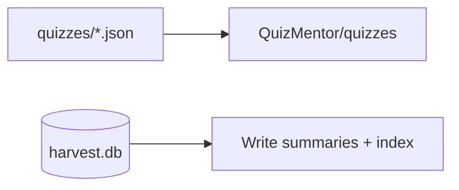

# Lesson 04 – Importers (QM & AI‑Research)

Narrative: Dock files to QM; write summaries + index for AI‑Research.

## Diagram


## Mini-lab
- Dry-run research import; then write two entries.

Commands
```bash
# Dry-run research importer
scraper import research \
  --db /tmp/harvest/harvest.db \
  --repo /Users/betolbook/Documents/github/AI-Research \
  --edition PRO --min-quality 0.75 --dry-run --limit 2

# Remove --dry-run to write summaries and update index
```

## Grok check
- How do we ensure idempotency on re-run?

## Mastery
<MasteryChecklist id="lessons/04" :items='[
  "Dock to QM stably",
  "Write 2 summaries",
  "Append index rows",
  "Re-run without duplicates"
]' />

