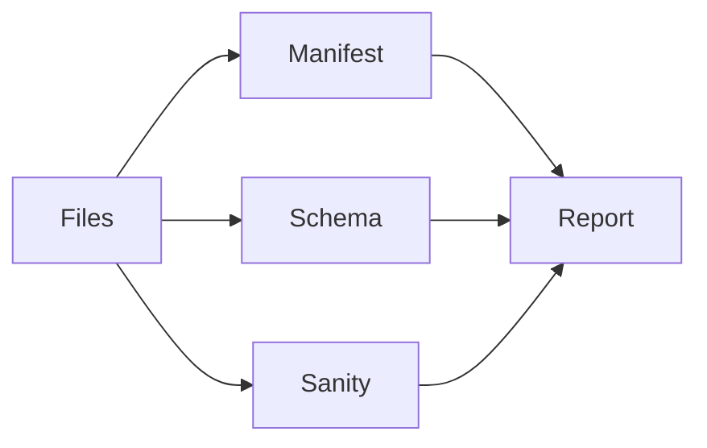

# Lesson 07 – Strict Gates & Validation

Narrative: Fail-fast on manifest, minimal schema, and sanity stats.

## Diagram


## Mini-lab
- Corrupt a quiz file; run validate; fix and rerun.

Commands
```bash
# Validate exported quiz files (planned command)
scraper validate quiz --from ./out
```

Helper validator (now)
```bash
# Validate a directory of quiz_*.json (use fixtures to try it)
python3 scripts/validate_quiz_dir.py --from docs/fixtures/quizzes

# Example against your export output
python3 scripts/validate_quiz_dir.py --from ./out/quizzes
```

## Grok check
- Why minimal schema instead of a full registry?

## Mastery
<MasteryChecklist id="lessons/07" :items='[
  "Validate manifest checksums",
  "Validate minimal schema",
  "Interpret sanity stats",
  "Explain strict vs warn"
]' />

