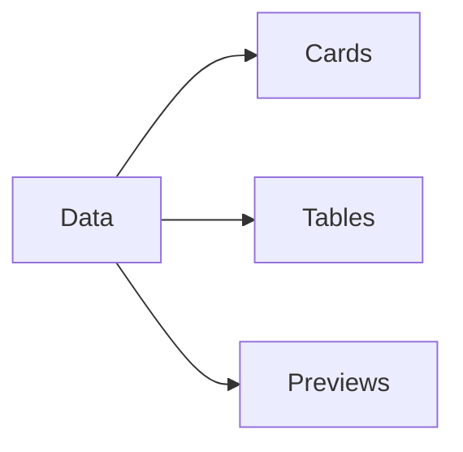

# Lesson 08 – HTML Reports

Narrative: Summarize artifacts, gates, previews, and parameters into a static report.

## Diagram


## Mini-lab
- Open a sample report; locate totals, warnings, and previews.

Commands
```bash
# Generate a report with previews
scraper ship local \
  --qm /path/to/QuizMentor.ai/quizzes \
  --research /path/to/AI-Research \
  --report-dir ./reports \
  --preview --strict --max-content 80 --questions-per-content 5

# Open it
open ./reports/ship-report.html 2>/dev/null || xdg-open ./reports/ship-report.html || true
```

## Grok check
- What signals indicate a healthy run?

## Mastery
<MasteryChecklist id="lessons/08" :items='[
  "Open ship-report.html",
  "Find totals and warnings",
  "Read preview samples",
  "Relate to CLI params"
]' />

