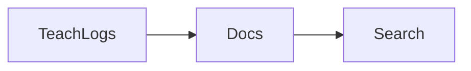

# Lesson 09 – Learning Center Integration

Narrative: Docs and teach logs cross-link; search-first flows.

## Diagram


## Mini-lab
- Click from a teach label to the relevant doc section.

Commands
```bash
# Emit teach logs that map to README anchors
scraper ship local \
  --qm /path/to/QuizMentor.ai/quizzes \
  --research /path/to/AI-Research \
  --report-dir ./reports \
  --teach --preview --strict --max-content 40 --questions-per-content 4
```

## Grok check
- Why do labeled logs improve onboarding?

## Mastery
<MasteryChecklist id="lessons/09" :items='[
  "Find a teach label",
  "Open linked doc section",
  "Search for glossary term",
  "Explain the learn-in-place model"
]' />

