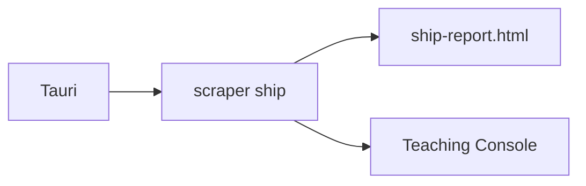

# Lesson 10 – Tauri UI (Desktop)

Narrative: GUI shelling out to CLI; render report and stream teach logs.

## Diagram

## Mini-lab
- Prototype a call to scraper via Tauri commands (conceptual).

## Grok check
- What are the security constraints for a local-first app?

## Mastery
<MasteryChecklist id="lessons/10" :items='[
  "Explain the invocation model",
  "Outline logs streaming",
  "List minimal permissions",
  "Sketch a settings screen"
]' />

