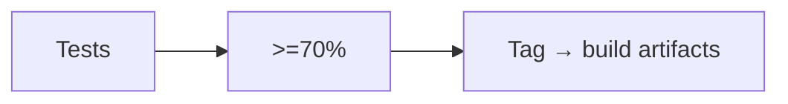

# Lesson 11 – Packaging & CI

Narrative: Tests → coverage gates → release artifacts; no network in CI.

## Diagram

## Mini-lab
- Run unit tests locally; inspect coverage and fail conditions.

## Grok check
- Why avoid network calls in CI tests?

## Mastery
<MasteryChecklist id="lessons/11" :items='[
  "Run tests",
  "Read coverage report",
  "Describe release pipeline",
  "Explain reproducibility"
]' />

