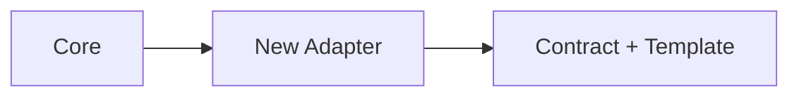

# Lesson 12 – Extensibility & Integrations

Narrative: Add new exporters/importers cleanly; optional enhancers.

## Diagram

## Mini-lab
- Sketch a new exporter interface (fields, mapping).

## Grok check
- What are the invariants adapters must preserve?

## Mastery
<MasteryChecklist id="lessons/12" :items='[
  "Document adapter contract",
  "Define schema mapping",
  "List validation steps",
  "Identify failure modes"
]' />

