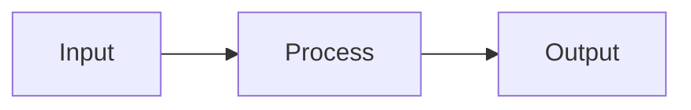

# Mini-lab: <topic>

## Goal
- What you will accomplish in ~15–30 minutes.

## Diagram


## Steps
1. Read the cheatsheet: /cheatsheets/<topic>
2. Run baseline
```bash
# baseline command
```
3. Change one variable; re-run; compare metrics

## Grok check
- Short questions to verify understanding

## Mastery checklist
- [ ] Key skill
- [ ] Key decision

## See also
- Cheatsheet, Path, Lab links

