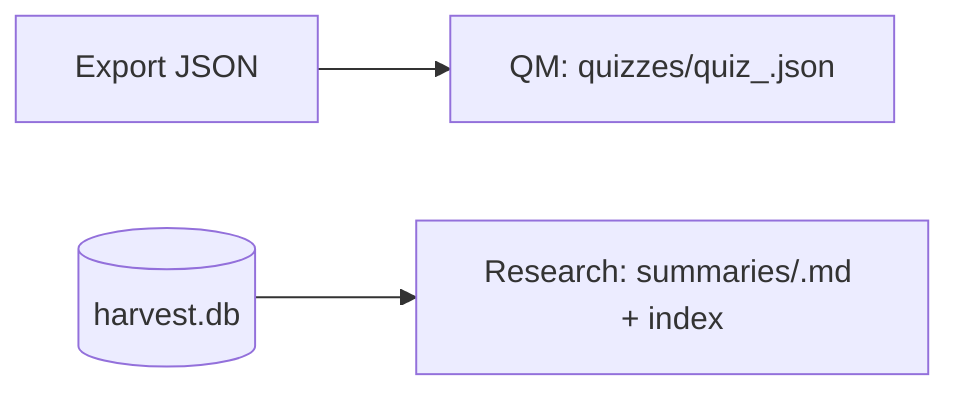

# Contracts – One‑pager (Meeting Mode)

## TL;DR
Two docking contracts: QuizMentor (quizzes/*.json) and AI‑Research (summaries/*.md + index.md append). Idempotent writes, minimal schemas, manifest guarding.

## Diagram


## Talking points
- QM schema: questions[], options[4], correct_answer (0..3), difficulty 1..5
- Research: slug rules, summary bullets (50–200 chars), >=80 char quotes
- Idempotency: skip existing slugs; index append only once
- Manifest + minimal schema gates for robustness

## Decisions & tradeoffs
- Overwrite vs curate staging files (QM)
- Strict vs warn on license/robots/PII (policy)

## Pitfalls
- Wrong correct_answer index; options length mismatch
- Duplicate slugs; missing category mapping

## Snippet
```json
{
  "quiz_id": "harvest_kubernetes",
  "questions": [
    { "question": "...", "options": ["A","B","C","D"], "correct_answer": 0 }
  ]
}
```

## See also
- Contracts → /contracts/S2S
- Cheatsheet → /cheatsheets/contracts
- Runbook → /ops/runbooks/ship-local

