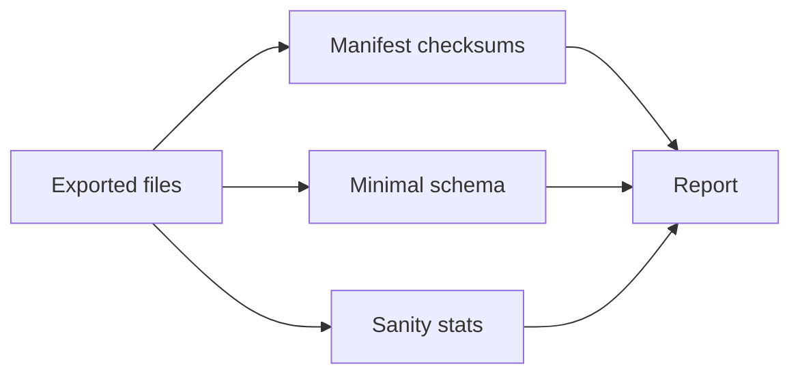

# Observability – One‑pager (Meeting Mode)

## TL;DR
Validate artifacts early with manifest + minimal schema + sanity stats. Use teach logs for explainability and HTML report for previews.

## Diagram


## Talking points
- Gates: manifest (sha256, size, totals), schema (minimal), sanity (counts, duplicates, confidence)
- Logs: --teach for labeled decisions mapping back to docs
- Report: totals, per‑quiz listing, previews, parameters

## Decisions & tradeoffs
- Strict vs warn gates
- Minimal schema vs full schema registry

## Pitfalls
- Skipping gates; shipping corrupt or incomplete files
- Not sampling outputs before dock/import

## Snippet
```bash path=null start=null
scraper validate quiz --from ./out
```

## See also
- Cheatsheet → /cheatsheets/observability
- Report card (HTML) – see README and EPICS

