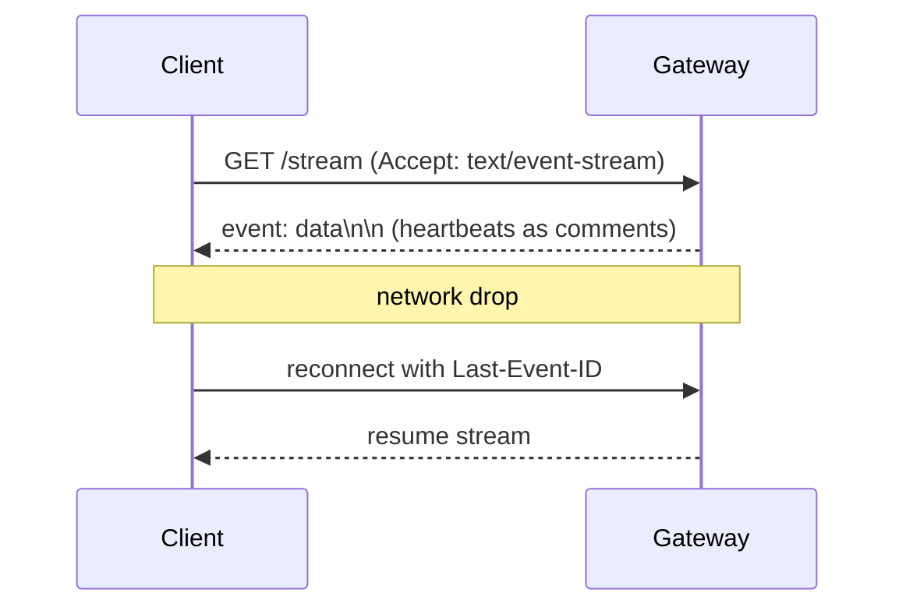

# SSE / Resilience – One‑pager (Meeting Mode)

## TL;DR
Use SSE with heartbeats and id resume. On failure, reconnect with backoff and Last‑Event‑ID to continue the stream.

## Diagram


## Talking points
- Headers: Content-Type: text/event-stream; Cache-Control: no-cache
- Heartbeats: comment lines to keep connections alive
- Backoff: exponential retry; cap and jitter
- Resume: Last-Event-ID header or query to resume

## Decisions & tradeoffs
- Event sizes: small chunks vs fewer larger messages
- Retry budgets and UX latency

## Pitfalls
- Missing heartbeat → idle timeout
- Not honoring Last-Event-ID → duplicate or lost chunks

## Snippet
```js path=null start=null
const es = new EventSource('/stream')
es.onmessage = (e) => {
  // handle e.data
}
es.onerror = () => {
  // browser auto-reconnects; server should use Last-Event-ID
}
```

## See also
- Cheatsheet → /cheatsheets/gateway_sse
- Architecture (Gallery) → /architecture/GALLERY

