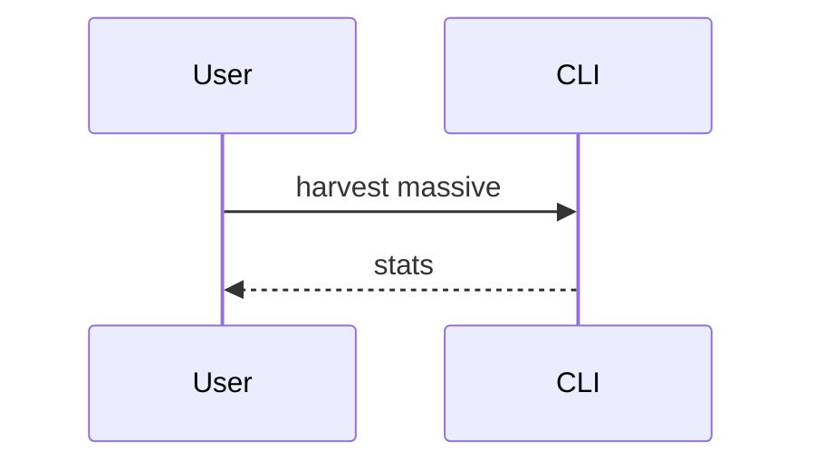

# Lesson Skeleton

- Narrative overview
- Diagram (Mermaid)
- Mini-lab (hands-on)
- Grok check (self-quiz)
- Mastery checklist

Example Mermaid block:

```mermaid
sequenceDiagram
  participant U as User
  participant C as CLI
  U->>C: harvest massive
  C-->>U: stats
```

